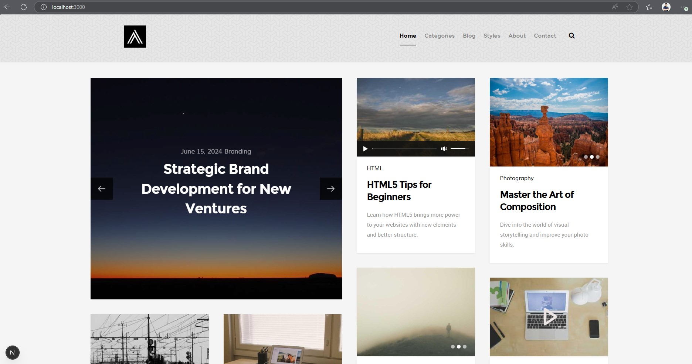

# News CMS - Next.js Content Management System

A modern, responsive news and content management system built with Next.js, featuring multiple post types including standard articles, videos, audio, galleries, and featured content.



## Features

- **Multiple Post Types**:
  - Standard text articles
  - Video posts with YouTube integration
  - Audio posts with media player
  - Image galleries
  - Featured highlighted posts

- **Category-based Navigation**: Browse content by categories

- **Responsive Design**: Works on all devices from mobile to desktop

- **Interactive Components**:
  - Masonry layout for the main content grid
  - Modal video player for YouTube content
  - Comment system
  - Interactive maps integration
  - Back-to-top functionality

- **Pagination**:
  - Implemented on the Home page for main article listings
  - Present on Category pages for filtered content
  - Efficient loading of content for better performance

- **Custom Font Integration**: Montserrat, Roboto, and Muli fonts

## Tech Stack

- **Frontend Framework**: Next.js (React)
- **Styling**: CSS with custom styles
- **Font Icons**: Font Awesome and Micons
- **JavaScript Libraries**:
  - jQuery for DOM manipulation and animations
  - Masonry for grid layout
  - MediaElement for audio playback
  - React Modal Video for video embeds
  - Leaflet for maps

## Getting Started

### Prerequisites

- Node.js 16.x or later and npm/yarn package manager
  OR
- Docker and Docker Compose

### Standard Installation

1. Clone the repository:
   ```bash
   git clone https://github.com/your-username/sd2411-news-cms.git
   cd sd2411-news-cms
   ```

2. Install dependencies:
   ```bash
   # Use legacy-peer-deps to handle React version conflicts
   npm install --legacy-peer-deps
   # or
   yarn install --legacy-peer-deps
   ```

3. Run the development server:
   ```bash
   npm run dev
   # or
   yarn dev
   ```

4. Open [http://localhost:3000](http://localhost:3000) with your browser to see the result.

### Docker Installation

1. Clone the repository:
   ```bash
   git clone https://github.com/your-username/sd2411-news-cms.git
   cd sd2411-news-cms
   ```

2. Build the Docker image:
   ```bash
   # Using the npm script
   npm run docker:build
   
   # Or directly with Docker
   docker build -t news-cms .
   ```

3. Run the container:
   ```bash
   # Using the npm script
   npm run docker:run
   
   # Or directly with Docker
   docker run -p 3000:3000 news-cms
   ```

4. Open [http://localhost:3000](http://localhost:3000) with your browser to see the result.

### Docker Compose (Development)

For a more convenient development experience with Docker, you can use Docker Compose:

1. The project already includes a `docker-compose.yml` file for development.

2. Run with Docker Compose:
   ```bash
   # Using the npm script
   npm run docker:dev
   
   # Or directly with Docker Compose
   docker compose up --build
   ```

3. For detached mode (running in background):
   ```bash
   docker compose up --build -d
   ```

4. To stop containers:
   ```bash
   docker compose down
   ```

## Project Structure

- `/components` - Reusable React components
  - `/commons` - Shared components like comments and maps
  - `/postTypes` - Different post type components (Video, Audio, Gallery, etc.)
  
- `/config` - Application configuration

- `/data` - JSON data files for categories and posts

- `/fonts` - Custom web fonts (Montserrat, Muli, Roboto)

- `/hooks` - Custom React hooks for functionality like Back-to-Top and Masonry initialization

- `/pages` - Next.js pages including routes for blog posts and categories

- `/public` - Static assets including images and third-party scripts

- `/styles` - CSS stylesheets for various components and global styles

## Data Structure

The application uses JSON files in the `/data` directory to store:
- Post content and metadata
- Category information
- Site configuration

## Available Scripts

### NPM Scripts
- `npm run dev` - Start development server
- `npm run build` - Build for production
- `npm start` - Start production server
- `npm run lint` - Run linting

### Docker Commands
- `docker build -t news-cms .` - Build production Docker image
- `docker run -p 3000:3000 news-cms` - Run production Docker container
- `docker-compose up` - Start development Docker environment
- `docker-compose down` - Stop and remove development Docker containers
- `docker-compose up --build` - Rebuild and start development Docker environment

## Dependency Considerations

This project contains some dependency version conflicts, particularly:

- **React Version Mismatch**: The `react-modal-video@2.0.2` package requires React 17/18, while the project uses React 19.x.

### How We Resolved It

- For development and production builds in Docker, we use the `--legacy-peer-deps` flag to handle these mismatches.
- This is automatically configured in the Dockerfile and Dockerfile.dev files.

### Alternative Solutions

If you encounter issues with the current approach, consider:

1. **Downgrading React**: Revert to React 18.x (requires updating Next.js as well)
2. **Finding an Alternative Package**: Replace `react-modal-video` with a more updated alternative
3. **Forking and Updating**: Create a fork of `react-modal-video` with updated React peer dependencies

## TODO / Future Enhancements

### Database Integration
- Replace JSON file storage with a proper database solution (MongoDB, PostgreSQL, etc.)
- Implement data models for Categories, Posts, and Comments
- Set up database connection and ORM/query layer

### Admin Portal
- Create an admin dashboard for content management
- Implement CRUD operations for all content types:
  - Category management
  - Post creation and editing
  - Comment moderation

### Authentication
- Implement user authentication system
- Create login/registration pages
- Set up role-based access control (admin, editor, user)

### User Interaction
- Enable users to post comments on articles
- Implement comment replies and threading
- Build a contact form submission system with backend storage

### Pagination Enhancements
- Extend existing pagination with "Load more" functionality
- Create pagination for comments on article pages
- Implement infinite scrolling option as an alternative to traditional pagination
- Add page size controls to let users choose how many items to display

### Search Functionality
- Implement full-text search across all posts
- Create an advanced search page with filters
- Add search suggestions and autocomplete

### Bug Fixes
- Fix runtime error: "Cannot read properties of undefined (reading 'language')"
- Improve error handling across the application
- Add proper loading states for asynchronous operations

## Learn More

To learn more about the technologies used in this project:

- [Next.js Documentation](https://nextjs.org/docs)
- [React Documentation](https://reactjs.org/docs/getting-started.html)
- [Masonry Layout](https://masonry.desandro.com/)

## License

This project is licensed under the MIT License - see the LICENSE file for details.
